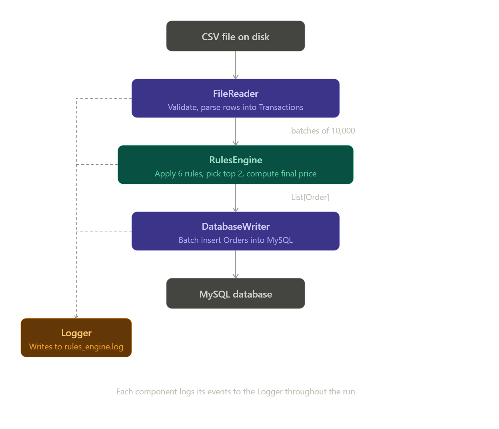
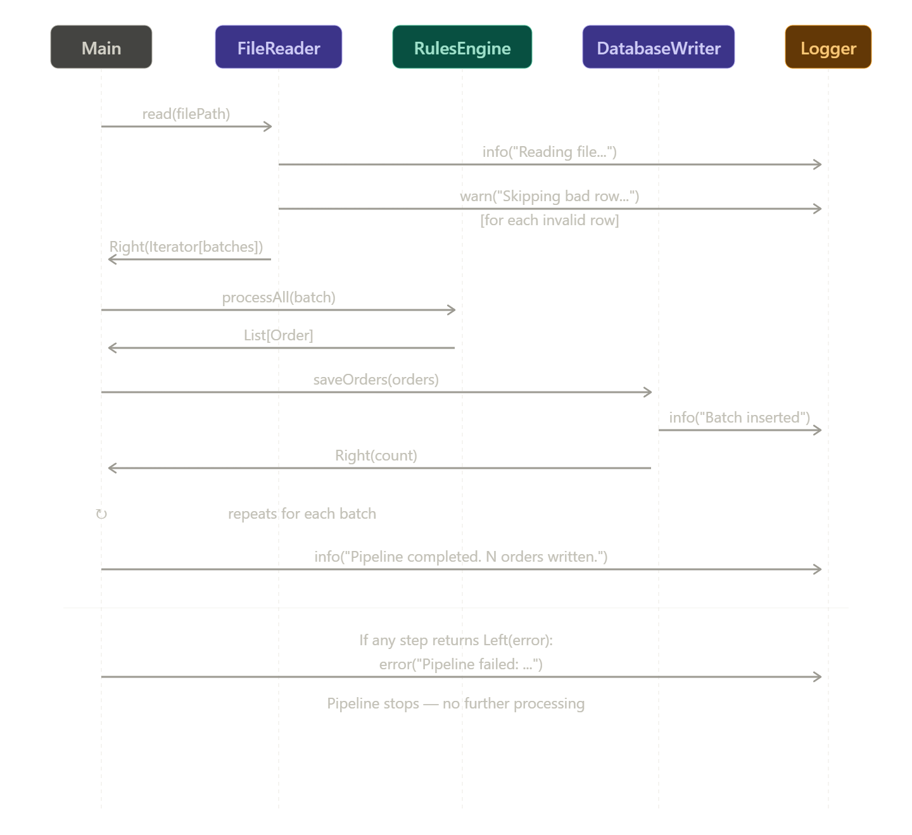
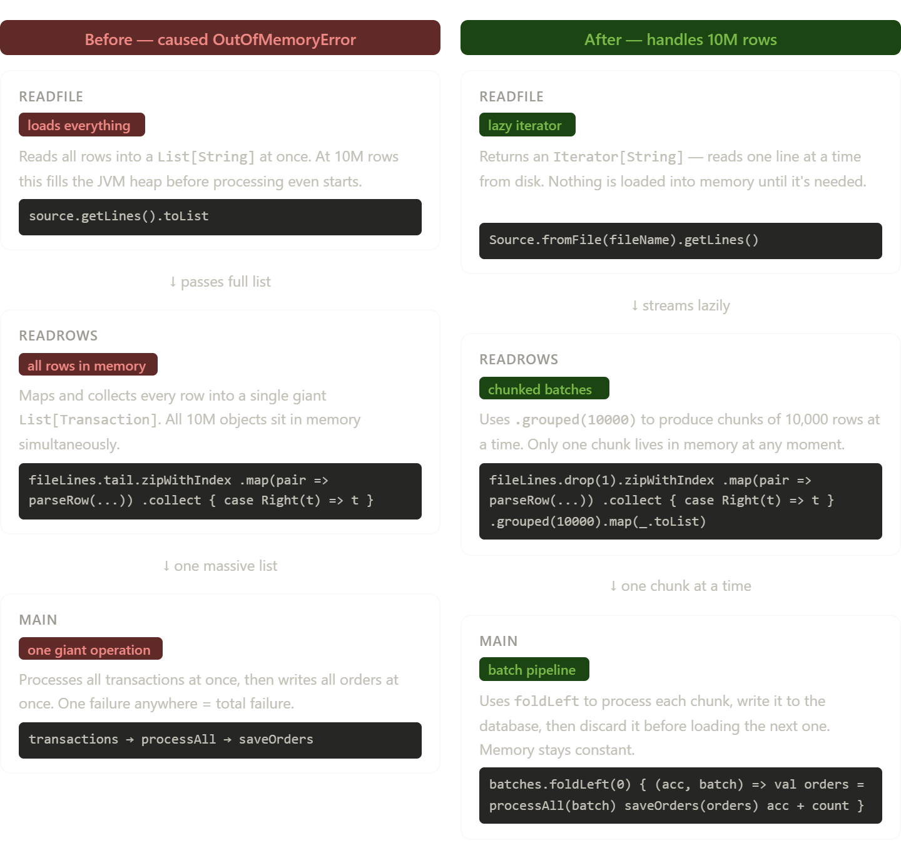

# Discount Rule Engine using FP on Scala

A rule-based discount engine built with Scala using Functional Programming principles. The engine reads transaction data from a CSV file, applies a set of discount rules to each transaction, calculates the final price, and writes the results to a MySQL database.

---

## Table of contents

- [How to run](#how-to-run)
- [Database setup](#database-setup)
- [Project structure](#project-structure)
- [Discount rules](#discount-rules)
- [How the pipeline works](#how-the-pipeline-works)
- [Component interactions](#component-interactions)
- [Strengths](#strengths)
- [Challenges and how we solved them](#challenges-and-how-we-solved-them)
- [Known limitations](#known-limitations)

---

## How to run

**Requirements:**
- Scala 2.13.x
- SBT
- MySQL 8.x

**Steps:**

```bash
# Clone the repo
git clone 
cd 

# Set your database credentials as environment variables
export DB_URL=jdbc:mysql://localhost:3306/orders_db
export DB_USER=root
export DB_PASS=yourpassword

# Place your CSV file in the project root and name it:
# TRX1000.csv

# Run
sbt run
```

The engine will log all events to `rules_engine.log` in the project root.

---

## Database setup

Run this SQL to create the table before running the engine:

```sql
CREATE DATABASE IF NOT EXISTS orders_db;

USE orders_db;

CREATE TABLE IF NOT EXISTS orders (
  id              INT AUTO_INCREMENT PRIMARY KEY,
  timestamp       DATETIME,
  product_name    VARCHAR(255),
  expiry_date     DATE,
  quantity        INT,
  unit_price      DOUBLE,
  channel         VARCHAR(50),
  payment_method  VARCHAR(50),
  discount        DOUBLE,
  final_price     DOUBLE
);
```

---

## Project structure

```
src/main/scala/
├── engine/
│   ├── Rules.scala          # All discount rule definitions
│   └── RulesEngine.scala    # Applies rules and computes final prices
├── models/
│   ├── Transaction.scala    # Raw input row from CSV
│   └── Order.scala          # Processed output row with discount and final price
├── utils/
│   ├── FileReader.scala     # Reads and validates the CSV file
│   ├── DatabaseWriter.scala # Writes processed orders to MySQL
│   └── Logger.scala         # Writes events to rules_engine.log
└── Main.scala               # Entry point, wires the pipeline together
```

---

## Discount rules

The engine checks each transaction against various rules. If a transaction qualifies for more than one rule, it receives the average of the top two discounts. If it qualifies for none, the discount is 0%.

| Rule | Qualifying condition | Discount |
|---|---|---|
| Expiry rule | Product expires in less than 30 days | 1% per remaining day (e.g. 29 days left = 1%, 15 days left = 15%) |
| Product type | Product name contains "Cheese" | 10% |
| Product type | Product name contains "Wine" | 5% |
| Special date | Transaction made on March 23rd | 50% |
| Quantity | 6–9 units | 5% |
| Quantity | 10–14 units | 7% |
| Quantity | 15+ units | 10% |
| App channel | Transaction made via the App | `ceil(quantity / 5) * 5%` (e.g. qty 3 = 5%, qty 6 = 10%) |
| Visa payment | Payment made with Visa | 5% |

**Final price formula:**
```
final_price = unit_price × quantity × (1 - discount)
```

---

## How the pipeline works



---

## Component interactions

See the sequence diagram below for a detailed view of how `Main`, `FileReader`, `RulesEngine`, `DatabaseWriter`, and `Logger` talk to each other during a normal run.


---

## Strengths

**Scalable**
The engine does not load the entire file into memory. Instead it reads the file lazily and processes it in batches of 10,000 rows at a time. This means it uses the same amount of memory whether the file has 1,000 rows or 10,000,000 rows. Processing is also done in parallel within each batch using Scala's parallel collections.

**Easy to extend with new rules**
Adding a new discount rule requires only two things: write the rule function in `Rules.scala` and add it to the `allRules` list. Nothing else in the codebase needs to change. The engine automatically picks it up.

**Errors do not stop the pipeline**
Bad rows in the CSV are logged as warnings and skipped. The pipeline continues with the remaining valid rows. A single broken line does not crash the whole run.

**Clean separation of concerns**
Each file has one job. `FileReader` reads, `RulesEngine` calculates, `DatabaseWriter` writes, `Logger` logs. None of these know about each other's internals.

**Database credentials are not hardcoded**
Credentials are read from environment variables at runtime, with sensible defaults for local development. This makes it safe to push the code to a public repository.

---

## Challenges and how we solved them

### 1. Java out of memory error at scale

**What happened:**
When we scaled from 1,000 to 10,000,000 rows, the JVM ran out of memory and crashed. The entire file was being loaded into a `List` before any processing began, which meant all 10 million rows were sitting in RAM at once.

**How we fixed it:**
We changed the file reading strategy from loading everything upfront to streaming lazily. The key changes were:

- `readFile` now returns an `Iterator[String]` instead of a `List[String]`. An iterator reads one line at a time from disk — nothing is loaded until it is needed.
- We used `.grouped(10000)` to split the stream into chunks of 10,000 rows.
- `Main` now processes one chunk at a time using `foldLeft`. After each chunk is written to the database, it is discarded from memory before the next one is loaded.

This means memory usage stays constant no matter how large the file is.

See the before/after comparison diagram below.



---

### 2. Timestamp format mismatch

**What happened:**
The CSV timestamps looked like `2023-04-18T18:18:40Z`. The trailing `Z` (which means UTC timezone) caused `LocalDateTime.parse` to throw an exception, because the default parser does not expect it.

**How we fixed it:**
We strip the `Z` before parsing using `.stripSuffix("Z")`, leaving `2023-04-18T18:18:40` which parses cleanly with no extra configuration needed.

```scala
LocalDateTime.parse(columns(0).stripSuffix("Z"))
```

---

### 3. Type mismatch between LocalDateTime and LocalDate

**What happened:**
The expiry discount rule was calling `ChronoUnit.DAYS.between(t.timestamp, t.expiryDate)`. The problem is that `timestamp` is a `LocalDateTime` (has a date and a time) while `expiryDate` is a `LocalDate` (has only a date). Scala's time library does not allow comparing these two types directly and throws an error at runtime.

**How we fixed it:**
We strip the time component from the timestamp before comparing, using `.toLocalDate`:

```scala
ChronoUnit.DAYS.between(t.timestamp.toLocalDate, t.expiryDate)
```

Now both sides are `LocalDate` and the comparison works correctly.

---

### 4. Floating point precision

**What happened:**
Discount values like `0.03` were being stored as `0.030000000000000002` due to how computers represent decimal numbers in binary. This caused ugly values in the database.

**How we fixed it:**
We round all discount and final price values to 2 decimal places using:

```scala
math.round(value * 100.0) / 100.0
```

This is applied at the end of `aggregateDiscounts` and `computeFinalPrice`.

---

### 5. Parallel collections not available by default

**What happened:**
Using `.par` on a `List` failed to compile because in Scala 2.13, parallel collections were moved to a separate library that is not included by default.

**How we fixed it:**
We added the dependency to `build.sbt`:

```scala
libraryDependencies += "org.scala-lang.modules" %% "scala-parallel-collections" % "1.0.4"
```

And imported it where needed:

```scala
import scala.collection.parallel.CollectionConverters._
```

---

## Known limitations

- For truly massive files (hundreds of millions of rows), migrating to Apache Spark would give distributed processing across multiple machines. The current implementation is single-machine only.
- The file is read twice during validation (once in `validateNotEmpty`, once in `readRows`). This is a minor inefficiency that could be removed with a small refactor.
- Batch size is currently hardcoded at 10,000. In a production system this would be a configurable parameter.
- All rules had to be modified from private in order to not cause conflict with our test cases, this should be further investigated to ensure the user can only access the exposed allRules List
- The pipeline assumes Database and Table existence, need to make the process of creation dynamic in case of absence of both.
